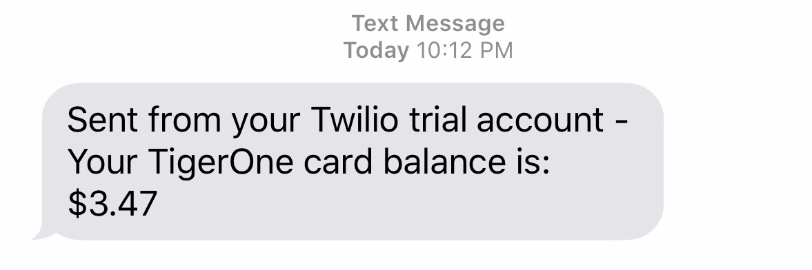

# TigerBalance

Automate the checking of your TigerOne card balance and send a helpful text to your phone. Instead of clicking through the multiple windows required to check your balance, save a couple seconds and run this program!* Have your balance conveniently texted to your phone for quick access.

\* Code will need to be personalized. Contact me for authorization!

## How to run

You will need python, as well as a few modules for the program to work.

Run: `pip install -r requirements.txt`
 
Get the Firefox GeckoDriver [here](https://github.com/mozilla/geckodriver/releases) and add it to your PATH
  
After customizing the code to your need (see 'Personalization' below) run : `python3 TigerOne.py`
  
## Personalization

The code will need to be personalized.

On line 14, 15, and 51: You will need Twilio API credentials. Contact me or use your own

On line 30 and 31: You will need to enter your iROAR username and password. I do not recommend hardcoding them. Use enviroment variables or another form of auth.

On line 52: Enter your phone number in the format "+1##########"

## Implementation

I have a slightly modified version of the program which I am running on a Raspbery Pi 3b+. The program runs every hour and will notify me of any balance changes since the last run. This way I am always notified within an hour if my balance increases/decreases.

### Contact

email - hriewe13 at gmail.com
